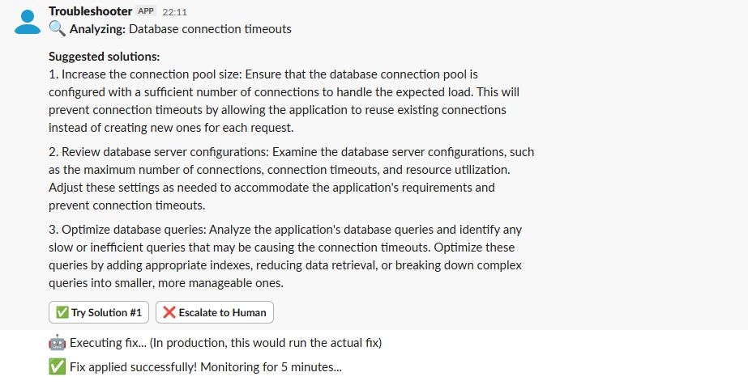

# AI Troubleshoot Bot — Human-in-the-Loop Incident Response

> **Built in 24 hours.** Production-style AI incident response with human oversight baked in.

An AI-powered Slack bot that helps engineering teams resolve incidents faster — Claude AI diagnoses the issue and suggests fixes, humans stay in control of execution.

---

## Demo



*Real interaction: Engineer types `/troubleshoot database connection timeouts` → AI analyzes → suggests 3 fixes → human approves → bot executes*

---

## The Flow

```
Engineer types: /troubleshoot [describe the issue]
                        ↓
     Claude AI (via Amazon Bedrock) analyzes the issue
                        ↓
       Returns 3 ranked fix suggestions with reasoning
                        ↓
            Human reviews and chooses:
    ┌──────────────────────────────────────┐
  Approve              Reject          Escalate
    ↓                                      ↓
Bot executes                      On-call engineer
  the fix                           gets notified
    ↓
Monitoring for 5 minutes...
```

---

## Why Human-in-the-Loop?

Fully autonomous incident response is a liability in production. This architecture gives you:

- **Speed of AI** — diagnosis and option generation in seconds
- **Safety of humans** — no action taken without explicit approval
- **Institutional memory** — every incident and resolution is logged, building a knowledge base over time
- **Scalability** — senior engineer judgment distributed across the entire team

---

## Tech Stack

| Component | Technology |
|-----------|------------|
| AI Model | Claude Sonnet via Amazon Bedrock |
| Bot Framework | Slack Bolt API (Python) |
| Language | Python 3 |
| Pattern | Human-in-the-Loop (HITL) |
| License | MIT |

---

## Setup

```bash
git clone https://github.com/Sudheer-029/slack-troubleshoot-bot.git
cd slack-troubleshoot-bot
pip install -r requirements.txt
```

Create `.env`:
```
SLACK_BOT_TOKEN=your_slack_bot_token
SLACK_SIGNING_SECRET=your_signing_secret
AWS_ACCESS_KEY_ID=your_aws_key
AWS_SECRET_ACCESS_KEY=your_aws_secret
AWS_REGION=us-east-1
```

Run:
```bash
python app.py
```

---

## Business Impact

| Metric | Outcome |
|--------|---------|
| Time to first suggestion | < 5 seconds |
| Context switching | Eliminated — engineers stay in Slack |
| Institutional knowledge | Captured on every incident |
| Production safety | Zero autonomous execution without human approval |
| MTTR reduction | Immediate — AI handles cognitive load of diagnosis |

---

## Key Concepts Demonstrated

- **Agentic AI with human oversight** — the right balance for production systems
- **AWS Bedrock integration** — Claude Sonnet via managed API
- **Slack Bolt event handling** — interactive message components, slash commands
- **Responsible AI design** — HITL pattern prevents uncontrolled autonomous action
- **Production-grade architecture** — logging, escalation path, monitoring window

---

## What's Next

- Learn from past approved fixes to reduce verification overhead over time
- Pattern matching on recurring incident types
- Integration with PagerDuty / OpsGenie for escalation routing

---

## License

MIT
